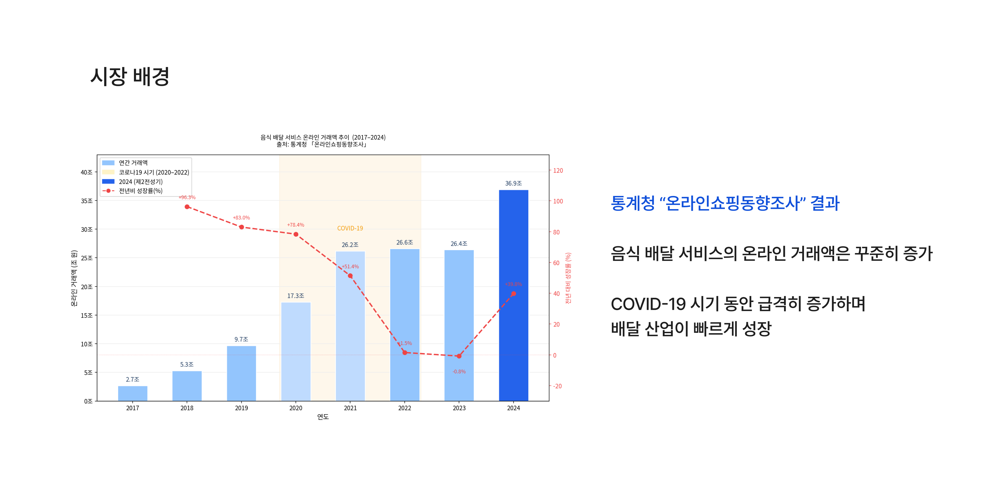
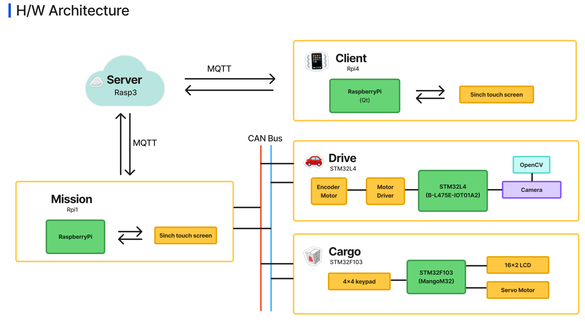
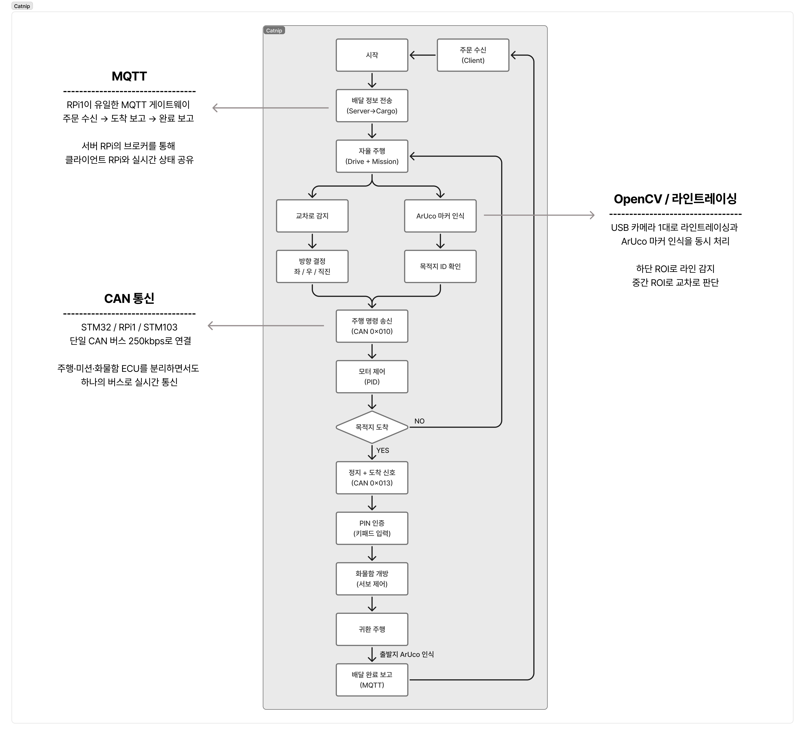
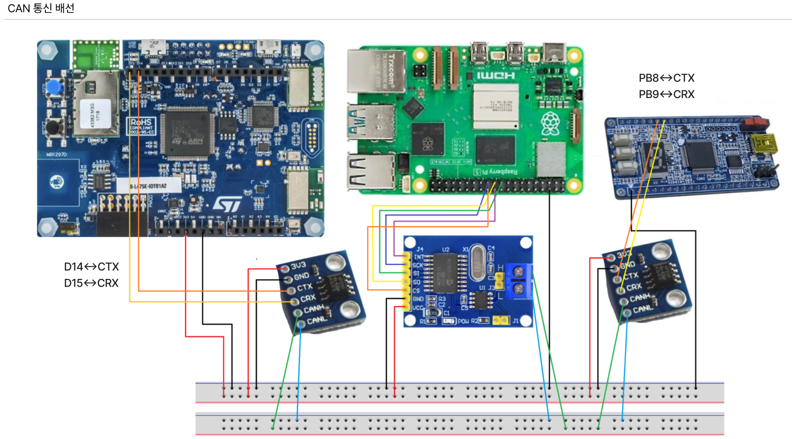
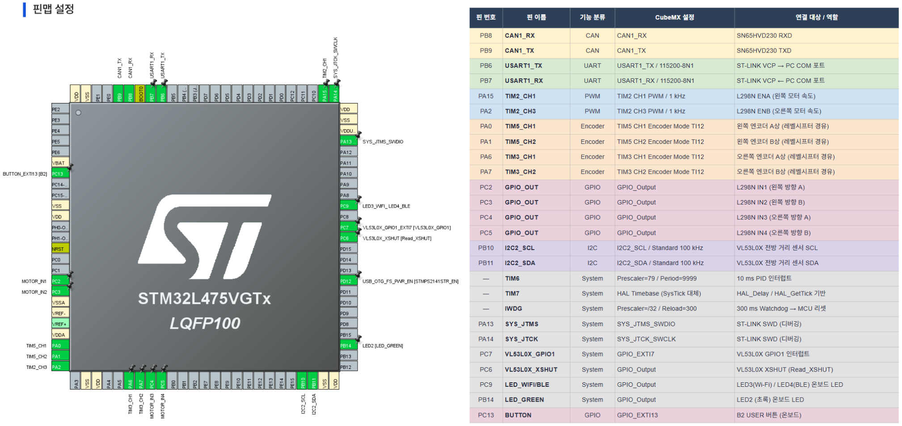
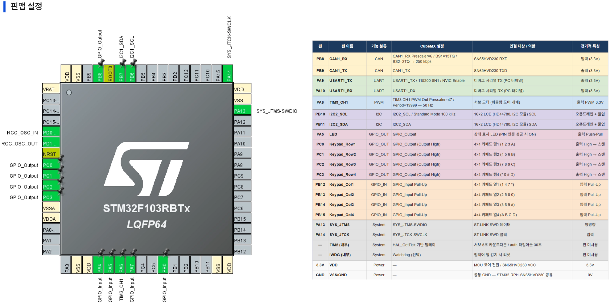

# CATNIP — CAN 기반 분산 ECU 무인 배달 차량 시스템

> STM32 × 2 + Raspberry Pi × 3 분산 ECU 아키텍처 기반 자율주행 무인 배달 RC카  
> Intel AI SW Academy 9기 1차 팀 프로젝트 (2026.02 ~ 2026.03)

<p align="center">
  
</p>

<!--  -->

---

## 💡 Motivation



- 배달 시장은 지속적으로 성장
- 중앙집중 구조의 한계 존재
- 차량 전장 시스템은 분산 ECU 구조 사용

👉 목표:
"소프트웨어가 아니라 구조를 설계하는 프로젝트"

---

## 📌 Key Features

- CAN 기반 실시간 분산 ECU 제어
- Vision + Control 완전 분리 구조
- Fail-safe 설계 (Watchdog + CAN Timeout)

---

## 🚀 Quick Start

```bash
# 1. RPi1 실행
./delivery 10.42.0.1

# 2. 서버 실행
./delivery_server

# 3. CAN 활성화
sudo ip link set can0 up type can bitrate 250000
```


---

## 🔧 Tech Stack


---

## 🏗️ Architecture




| 노드 | 보드 | 역할 | 설계 원칙 |
|---|---|---|---|
| STM32 | B-L475E-IOT01A (STM32L4) | 주행 ECU — 모터 / 엔코더 / PID | 판단하지 않는다. 명령 수행 + 센서 수집만 |
| RPi1 | Raspberry Pi | 미션 ECU — 라인트레이싱 / ArUco / MQTT | 모든 판단은 여기서 한다 |
| STM103 | STM32F103 (MangoM32) | 화물함 ECU — PIN 인증 / 서보 / LCD | 주행 ECU와 완전 독립된 보안 영역 |
| RPi3 | Raspberry Pi | MQTT 브로커 / 주문 중계 / SQLite | 실시간 제어에 절대 관여하지 않는다 |
| RPi4 | Raspberry Pi | Qt 주문 UI / 5인치 터치 디스플레이 | 고객 주문 접수 및 PIN 설정 |

---

## 🔄 System Flow



```
[RPi4] 목적지 + PIN 설정 → MQTT
         ↓
[RPi3] DB 저장 → 출동 명령 (PIN 포함) → MQTT
         ↓
[RPi1] CAN 0x012 → [STM103] PIN + 목적지 수신
         ↓
   ┌─ 자율 주행 루프 ─────────────────────────────────────┐
   │  카메라 → 라인 ROI 이진화 → 방향 결정                 │
   │  CAN 0x010 → [STM32] PID 모터 제어                   │
   │  교차로 감지 → 목적지별 행동 테이블 (좌/우/직진)      │
   │  ArUco 마커 감지 → 목적지 ID 확인                    │
   └─────────────────────────────────────────────────────┘
         ↓ 목적지 도착
[RPi1] 정지 + CAN 0x013 → [STM103] 도착 신호
         ↓
[STM103] PIN 인증 (키패드)
   ├── 성공 → 서보 개방 5초 → CAN 0x301=0x00 → RPi1 유턴
   ├── 5회 실패 → 10초 잠금 + MQTT alert
   └── 미수령 30초 → CAN 0x302=0x02 → RPi1 즉시 유턴
         ↓
[RPi1] 귀환 주행 → ArUco ID=0 감지 → MQTT completed
```

---

## 📡 CAN Protocol

통신 속도: **250 kbps** / 버스 점유율 1% 미만 / 직선(데이지체인) 구조 필수




| CAN ID | 내용 | 송신 | 수신 | 주기 |
|---|---|---|---|---|
| **0x010** | 주행 명령 (방향 + RPM) | RPi1 | STM32 | 50 ms |
| **0x011** | E-Stop | RPi1 | STM32 | 즉시 |
| **0x012** | 배달정보 (PIN + 목적지) | RPi1 | STM103 | 이벤트 |
| **0x013** | 도착 신호 | RPi1 | STM103 | 이벤트 |
| **0x100** | 속도 피드백 (RPM × 100) | STM32 | RPi1 | 50 ms |
| **0x200** | ECU Heartbeat (0xAA) | STM32 | RPi1 | 100 ms |
| **0x301** | 도어 상태 (0x00=닫힘) | STM103 | RPi1 | 이벤트 |
| **0x302** | 인증 결과 (0x01=성공 / 0x02=유턴) | STM103 | RPi1 | 이벤트 |
| **0x303** | PIN 5회 실패 잠금 | STM103 | RPi1 | 이벤트 |

> **0x013 분리 이유**: 도착 신호를 0x010과 같은 ID로 쓰면 STM32가 모터 명령으로 오인. STM103만 수신하도록 분리.

---

## 🌐 MQTT Topics

| 토픽 | 방향 | 내용 |
|---|---|---|
| `delivery/order/{order_id}/{destination}` | RPi4 → RPi3 | 주문 정보 (PIN + 메뉴) |
| `delivery/vehicle/{vehicle_id}/order` | RPi3 → RPi1 | 출동 명령 (PIN 포함) |
| `delivery/vehicle/{vehicle_id}/1to3` | RPi1 → RPi3 | 출발 / 도착 / 완료 보고 |
| `delivery/vehicle/{vehicle_id}/alert` | RPi1 → RPi3 | pin_locked 이벤트 |

브로커: `10.42.0.1:1883` (Pi5_MQTT_AP 핫스팟)

---

## ⚙️ 핵심 기능

**자율 주행**
- USB 카메라 1대로 라인트레이싱 + ArUco 마커 인식 동시 처리
- 하단 ROI: OTSU 이진화 → 무게중심 오차 기반 방향 결정
- 중간 ROI: L/M/R 3분할 픽셀 비율 기반 교차로 감지
- 목적지별 교차로 행동 테이블로 4개 목적지(A~D) 분기

**PIN 인증 화물함**
- 4자리 PIN을 RPi4 주문 시 설정 → CAN 0x012로 STM103에 전달
- 목적지 확인(A~D) + PIN 입력(# 제출) 2단계 인증
- 5회 실패 시 10초 잠금, 30초 미수령 시 자동 귀환

**Fail-safe**
- STM32 IWDG 300ms → RPi1 다운 시 MCU 리셋 + 모터 즉시 정지
- CAN 명령 5초 미수신 → `Motor_Stop()` 자동 실행
- `Motor_Stop()` 브레이크 모드: IN1=IN2=HIGH, IN3=IN4=HIGH (coast 방지)

---

## 🛠️ STM32 주행 ECU 상세

### 핀맵






| 기능 | 핀 | CubeMX 설정 | 연결 대상 |
|---|---|---|---|
| CAN1_RX/TX | PB8/PB9 | CAN1 250kbps | SN65HVD230 |
| USART1_TX/RX | PB6/PB7 | 115200/8N1 | ST-LINK VCP |
| TIM2_CH1/CH3 | PA15/PA2 | PWM 1kHz | L298N ENA/ENB |
| TIM5_CH1/2 | PA0/PA1 | Encoder Mode | 왼쪽 엔코더 (레벨시프터) |
| TIM3_CH1/2 | PA6/PA7 | Encoder Mode | 오른쪽 엔코더 (레벨시프터) |
| GPIO_OUT | PC2~PC5 | GPIO_Output | L298N IN1~IN4 |
| I2C2_SCL/SDA | PB10/PB11 | I2C2 | VL53L0X |

> ⚠️ B-L475E-IOT01A2 기본 초기화 시 온보드 UART4(PA0/PA1), SPI1(PA6/PA7)이 엔코더 핀을 선점함.  
> 반드시 온보드 주변장치를 비활성화한 상태(`base.ioc`)에서 프로젝트를 시작할 것.

### CubeMX 설정

```
CAN1:  Prescaler=16, BS1=13TQ, BS2=2TQ  → 250 kbps
TIM2:  Prescaler=79, Period=999          → 1 kHz PWM
TIM5/3: Encoder Mode TI12, Period=65535
TIM6:  Prescaler=79, Period=9999         → 10 ms PID 인터럽트
IWDG:  Prescaler=/32, Reload=300         → 300 ms Watchdog
Clock: HSI 16MHz → PLL → SYSCLK 80MHz
```

### 주요 파라미터

```c
#define PULSE_PER_REV       5280    // 실측 확정값
#define KP                  0.5f
#define KI                  0.05f
#define INTEGRAL_LIMIT      150.0f
#define CAN_CMD_TIMEOUT_MS  5000
```

---

## 🚀 빌드 및 실행

**RPi1 미션 ECU**

```bash
g++ delivery_mqtt.cpp -o delivery \
    $(pkg-config --cflags --libs opencv4) \
    -lmosquittopp -lpthread
./delivery 10.42.0.1
```

**RPi3 서버**

```bash
g++ -std=c++17 delivery_server.cpp -o delivery_server \
    -lmosquitto -lmosquittopp -lsqlite3
./delivery_server

# DB 조회
sqlite3 delivery_system.db \
    "SELECT order_id, destination, pin, status FROM order_table;"
```

**RPi1 CAN 인터페이스**

```bash
# /boot/config.txt
dtoverlay=mcp2515-can0,oscillator=8000000,interrupt=25

sudo ip link set can0 up type can bitrate 250000
sudo ip link set can0 txqueuelen 1000   # TX 큐 확장
```

---

## 📹 시연 영상

<!-- 📷 시연 영상 GIF 또는 썸네일 이미지 삽입 권장 -->
<!-- [](영상_링크) -->

[🎬 시연 영상 보기](https://www.notion.so/31eea995ce3b804a9e87f27209502f0e?source=copy_link#32cea995ce3b8059ab3bd7d488b34fa6)

---

## HW


---

## 👨‍💻 My Role

| 역할 | 내용 |
|---|---|
| PM | 프로젝트 주제 제안, 전체 일정 관리, 팀 노션 문서 구조 설계, 프로젝트 총 정리본 작성·유지 (v9.5) |
| 아키텍처 설계 | 차량 탑재 3개 노드 보드 선정, 화물함 ECU RPi → STM32F103 교체 결정, CAN 단일 버스 + MQTT 게이트웨이 구조 확정 |
| 하드웨어 배선 | B-L475E / STMF103 핀맵 확정 후 SN65HVD230 트랜시버 · 레벨시프터 · L298N · 엔코더 모터 실물 배선 및 선 정리, CAN 버스 데이지체인 구성 |
| STM32 주행 ECU | B-L475E 온보드 핀 충돌 분석 및 핀맵 재설계, 모터 PWM / 엔코더 RPM / 속도 PID / CAN 통신 구현 |
| MangoM32 CAN 검증 | 외부 디버거(NUCLEO ST-Link) 설정, Silent Loopback → Loopback → Normal 단계별 검증, 트랜시버 불량 + 종단저항 중복 문제 해결 |
| 통합 지원 | 라인트레이싱 + ArUco 막바지 코드 수정 지원, 발표 진행 |


---

## 👥 팀 구성

| 이름 | 역할 | 담당 영역 |
|---|---|---|
| 구영모 | FW-Drive / PM | STM32 주행 ECU + 아키텍처 설계 + 전체 문서 |
| 인수민 | FW-Drive | STM32 주행 ECU 공동 담당 |
| 윤성진 | Vision / System | RPi1 라인트레이싱 / ArUco / 미션 상태머신 |
| 김민우 | FW-Cargo | STM103 화물함 ECU (PIN / 서보 / LCD) |
| 최지호 | BE / Network | RPi3 서버 (Mosquitto / SQLite / MQTT) |
