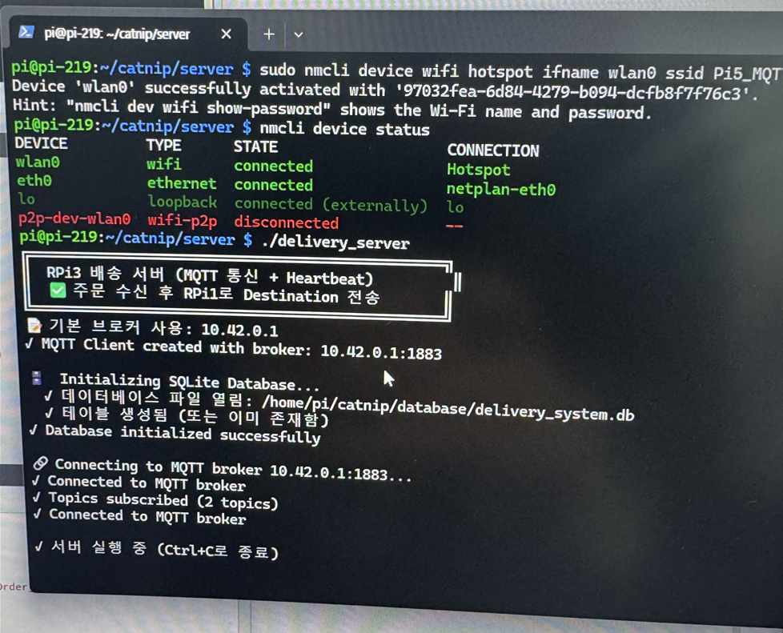

# RPi3 — 서버 ECU (Server)

> **CAN 기반 분산 ECU 무인 배달 차량 시스템** | CATNIP 팀



---

## 역할 및 개요

오프보드(오프카) **MQTT 브로커 및 관제 서버 노드**.

| 항목 | 내용 |
|------|------|
| 보드 | Raspberry Pi (오프보드) |
| 언어 | C++ |
| 주요 기능 | Mosquitto MQTT 브로커 운용, 주문 중계, SQLite DB 저장, 차량 Heartbeat 관제 |

### 설계 원칙
- **실시간 제어에 절대 관여하지 않는다.** 이벤트 기반 데이터 중계 및 저장만 담당
- RPi4 주문 → DB 저장 → RPi1 출동 명령 중계 (PIN 포함)
- 차량당 MQTT 연결 1개(RPi1)로 관리 단순화

---

## MQTT 프로토콜

### 구독 토픽

| Topic | 발행 | 내용 |
|-------|------|------|
| `delivery/order/+/+` | RPi4 | 주문 정보 (order_id, pin, menus) |
| `delivery/vehicle/+` | RPi1 | 차량 상태/보고/alert |

### 발행 토픽

| Topic | 수신 | 내용 |
|-------|------|------|
| `delivery/vehicle/{id}/order` | RPi1 | 출동 명령 (PIN 포함) |
| `delivery/order/{id}/3to4` | RPi4 | 주문 수신 ACK |
| `delivery/vehicle/{id}/3to1` | RPi1 | 차량 정보 수신 ACK |

### 출동 명령 페이로드 (RPi3 → RPi1)

```json
{
  "order_id": "Order_1",
  "vehicle_id": "vehicle_001",
  "destination": "A",
  "pin": "1234",
  "menus": "메뉴1, 메뉴2",
  "timestamp": "2026-03-09 10:00:00",
  "message_type": "order_assignment"
}
```

### 브로커 접속 정보

```
핫스팟 SSID: Pi5_MQTT_AP
IP:          10.42.0.1
포트:        1883
사용자명:    hoji
비밀번호:    1234
```

---

## DB 구조 (SQLite)

```sql
-- 차량 접속 기록
vehicle_table(id, timestamp, vehicle_id)

-- 배송 주문 (PIN 포함)
order_table(id, timestamp, order_id, destination, pin, menus, vehicle_id, status)

-- 차량 Heartbeat (2초 주기)
heartbeat_table(id, timestamp, vehicle_id, status)
```

### DB 조회

```bash
sqlite3 /home/pi/catnip/database/delivery_system.db \
    "SELECT order_id, destination, pin, status FROM order_table;"
```

---

## 메시지 처리 흐름

```
delivery/order/{id}/{dest} 수신
├── 토픽에서 destination 파싱 (A/B/C/D)
├── order_table DB 저장 (PIN 포함)
├── verify_order_in_database() 검증
├── send_order_to_vehicle() → RPi1 출동 명령 발행
└── delivery/order/{id}/3to4 → RPi4 ACK

delivery/vehicle/+ 수신
├── heartbeat=true → handle_heartbeat() → heartbeat_table 저장
└── 그 외          → handle_vehicle() → 보고 처리
    ※ alert 이벤트 별도 핸들러 추가 필요 (⚠️ 미구현)
```

---

## 빌드 및 실행

### 의존성 설치

```bash
sudo apt install libmosquitto-dev libmosquittopp-dev libsqlite3-dev
```

### 빌드

```bash
g++ -std=c++17 server_rpi.cpp -o delivery_server \
    -lmosquitto -lmosquittopp -lsqlite3
```

### 실행

```bash
./delivery_server               # 기본 브로커 10.42.0.1
./delivery_server 10.42.0.1     # 브로커 IP 명시
MQTT_BROKER_HOST=10.42.0.1 ./delivery_server  # 환경변수 방식
```

### Mosquitto 브로커 시작

```bash
sudo systemctl start mosquitto
sudo systemctl enable mosquitto   # 부팅 시 자동 시작
```

---

## 주의사항

- `delivery/vehicle/{id}/alert` 토픽 수신 시 별도 분기 없음 → `handle_vehicle()` 내 alert 핸들러 추가 필요
- 토픽 경로에서 destination 직접 파싱 (JSON `destination` 필드보다 토픽 우선)
