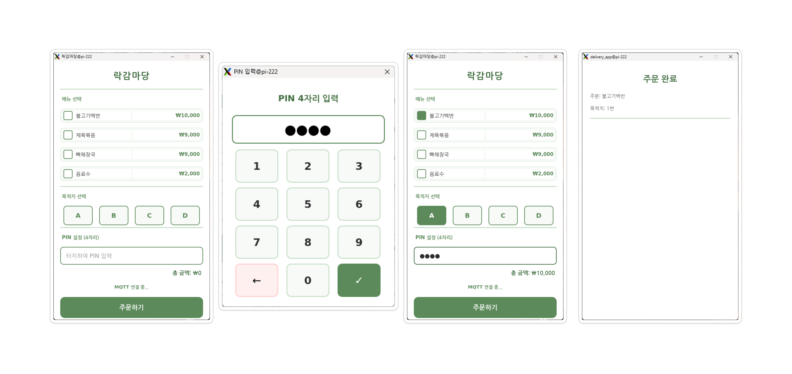

# RPi4 — 클라이언트 (Qt Client)
> **CAN 기반 분산 ECU 무인 배달 차량 시스템** | CATNIP 팀




---

## 역할 및 개요

오프보드(오프카) **고객 주문 UI 노드**.

| 항목 | 내용 |
|------|------|
| 보드 | Raspberry Pi (오프보드) |
| 언어 | C++ / Qt Widgets |
| 디스플레이 | 5인치 터치 디스플레이 (XPT2046) |
| 주요 기능 | 목적지(A~D) + PIN 4자리 설정, MQTT 주문 전송, 배달 완료 알림 수신 |

---

## 하드웨어 연결

```
RPi4
├── 5인치 터치 디스플레이 (XPT2046) ── DSI / SPI 터치 입력
└── Wi-Fi ──────────────────────────── MQTT → RPi3 (브로커: 10.42.0.1)

// 터치 스크린의 가장 자리는 잘 터치되지 않는 하드웨어적 이슈 있었음
```

<div align="center">
  
</div>

---

## 디렉터리 구조

| 디렉터리 | 설명 |
|----------|------|
| `catnip_client/MonitoringWithMenu/` | qmake 기반 Qt 프로젝트 (DeliveryUI.pro) |
| `catnip_client/delivery_client/` | CMake 기반 Qt 프로젝트 |
| `catnip_vehicle/` | 차량 제어 관련 코드 |

---

## MQTT 프로토콜

### 발행 토픽

| Topic | 수신 | 내용 |
|-------|------|------|
| `delivery/order/{order_id}/{destination}` | RPi3 | 주문 정보 |

### 구독 토픽

| Topic | 발행 | 내용 |
|-------|------|------|
| `delivery/order/{order_id}/3to4` | RPi3 | 주문 수신 ACK |

### 주문 페이로드 (RPi4 → RPi3)

```
토픽 예시: delivery/order/Order_1/A

JSON 페이로드:
{
  "order_id": "Order_1",
  "pin": "1234",
  "menus": ["메뉴1", "메뉴2"],
  "vehicle_id": "vehicle_001"
}
```

> 목적지(destination)는 토픽 경로에 포함. RPi3 서버가 토픽에서 직접 파싱.

### 브로커 접속 정보

```
IP:       10.42.0.1  (Pi5_MQTT_AP 핫스팟)
포트:     1883
사용자명: hoji
비밀번호: 1234
```

---

## 빌드 및 실행

### 의존성 설치

```bash
sudo apt install qt5-default libmosquitto-dev libmosquittopp-dev
```

### 빌드 (qmake 방식)

```bash
cd catnip_client/MonitoringWithMenu/MonitoringWithMenu/MonitoringWithMenu
qmake DeliveryUI.pro && make
```

### 빌드 (CMake 방식)

```bash
cd catnip_client/delivery_client
mkdir build && cd build
cmake .. && make
```

### 실행

```bash
./catnip_client
```

---

## 주의사항

- 터치 디스플레이(XPT2046) 드라이버 설정이 `/boot/firmware/config.txt`에 적용되어 있어야 함
- Wi-Fi가 `Pi5_MQTT_AP`에 연결된 상태에서 실행

```bash
sudo nmcli device wifi connect "Pi5_MQTT_AP" password "12345678"
```
